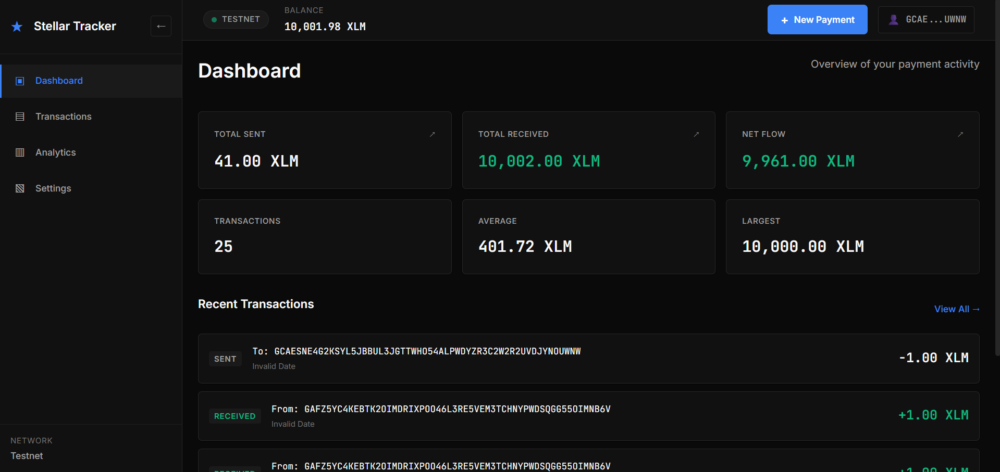
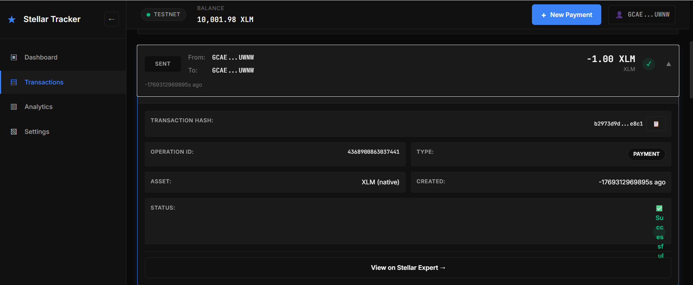
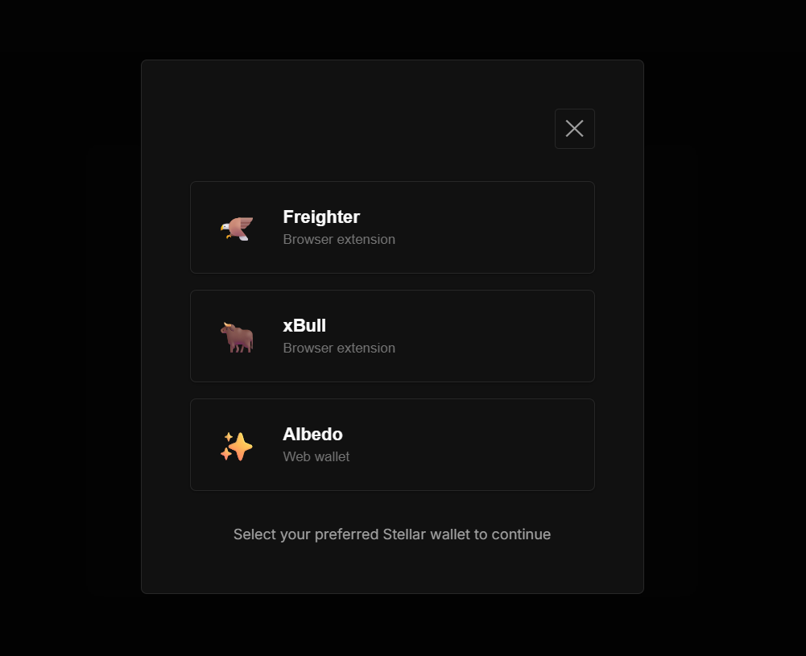

# Stellar Payment Tracker

A modern, responsive payment tracking dApp built on the Stellar blockchain with multi-wallet support and real-time transaction monitoring.

## 🚀 Live Demo

**Deployed Application:** _[Link will be added here]_

---

## ✨ Features

- 🔐 **Multi-Wallet Integration** - Freighter, xBull, and Albedo support
- 📊 **Real-Time Analytics** - Track sent, received, and total volume
- 💳 **Transaction Management** - View, filter, and search payment history
- 📱 **Fully Responsive** - Mobile-first design with tablet and desktop optimization
- 🎨 **Modern UI** - Clean glassmorphic interface with smooth animations
- ⚡ **Stellar Testnet** - Fast, low-cost transactions

---

## 🔌 Wallet Options

The application supports three major Stellar wallet providers:


**Available Wallets:**
- 🦅 **Freighter** - Browser extension wallet
- 🐂 **xBull** - Browser extension wallet
- ✨ **Albedo** - Web-based wallet

Users can connect with any installed wallet through a unified selection modal.

---

## 📝 Deployment Details

### Contract Address
```
CC5RS5GXAPO7NW27U65XXHKSEWO4ODYX5WLYDHCPBOX4XVXBP7LRFWQ2
```

### Network
Stellar Testnet

### Example Transaction Hash
```
41672e07b4d6ba3fd6f4a2755eb6be7db5fb4ac9b6eeb977c5f7f23ea939d67e
```

**Verify on Stellar Explorer:**  
[https://stellar.expert/explorer/testnet/tx/41672e07b4d6ba3fd6f4a2755eb6be7db5fb4ac9b6eeb977c5f7f23ea939d67e](https://stellar.expert/explorer/testnet/tx/41672e07b4d6ba3fd6f4a2755eb6be7db5fb4ac9b6eeb977c5f7f23ea939d67e)

---

## 🛠️ Tech Stack

- **Frontend:** React 18 + Vite
- **Backend:** Node.js + Express
- **Blockchain:** Stellar Soroban Smart Contracts
- **Wallet Integration:** stellar-wallets-kit
- **Styling:** CSS (Mobile-first responsive design)

---

## 🚀 Quick Start

### Prerequisites
- Node.js 18+ installed
- One of the supported Stellar wallets installed

### Frontend Setup
```bash
cd frontend
npm install
npm run dev
```

Frontend runs on: `http://localhost:5173`

### Backend Setup
```bash
cd backend
npm install
node server.js
```

Backend runs on: `http://localhost:3001`

---

## 📂 Project Structure

```
stellar-payment-tracker/
├── frontend/           # React application
│   ├── src/
│   │   ├── components/  # Reusable UI components
│   │   ├── pages/       # Page components
│   │   ├── hooks/       # Custom React hooks
│   │   └── config.js    # Contract configuration
│   └── package.json
├── backend/            # Express API server
│   ├── server.js       # Main server file
│   └── package.json
└── README.md
```

---

## ⚙️ Configuration

Update contract details in `frontend/src/config.js`:

```javascript
export const CONFIG = {
  CONTRACT_ID: 'YOUR_CONTRACT_ID',
  NETWORK: 'testnet', // or 'mainnet'
  RPC_URL: 'https://soroban-testnet.stellar.org'
};
```

---

## 📸 Screenshots

### Dashboard View


### Transaction History


### Multi-Wallet Selector


---

## 🌟 Key Features Implemented

### Responsive Design
- Mobile (< 768px): Single column layout, hamburger menu, FAB
- Tablet (768px - 1279px): 2-column grid, collapsible sidebar
- Desktop (≥ 1280px): 3-column grid, fixed sidebar

### Transaction Management
- Inline accordion expansion for transaction details
- Real-time filtering and sorting
- Copy transaction hash to clipboard
- Direct links to Stellar Explorer

### Wallet Integration
- Automatic wallet detection
- Session persistence
- Wallet-scoped state management
- Clean disconnect flow

---

## 📋 Submission Checklist

- ✅ Multi-wallet integration (Freighter, xBull, Albedo)
- ✅ Deployed contract address provided
- ✅ Transaction hash with Stellar Explorer link
- ✅ Clean, responsive UI
- ✅ GitHub repository with complete code
- ⏳ Live demo link (to be added upon deployment)

---

## 🤝 Contributing

Contributions are welcome! Feel free to open issues or submit pull requests.

---

## 📄 License

MIT License - feel free to use this project for learning and development.

---

**Built with ❤️ on Stellar**

🔗 [GitHub Repository](https://github.com/anuraggdubey/stellar-payment-tracker)
